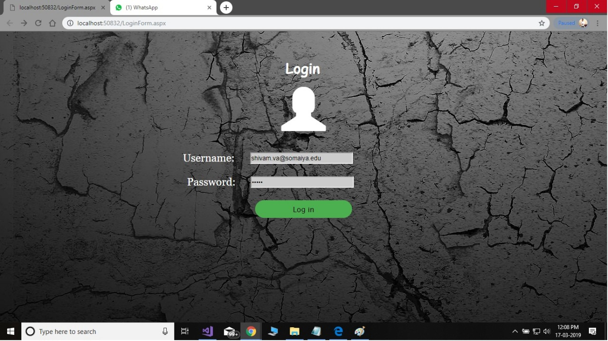
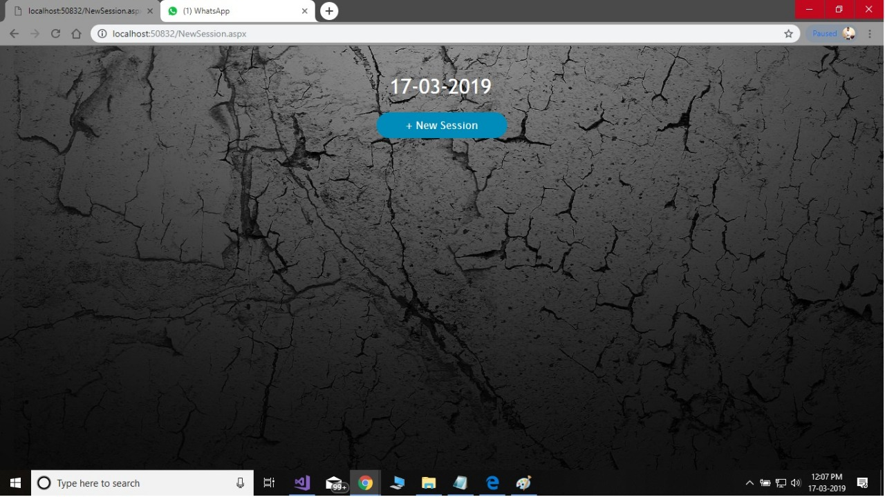
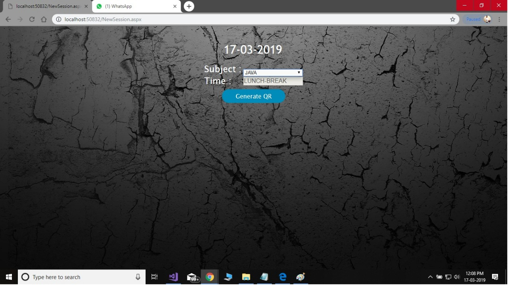
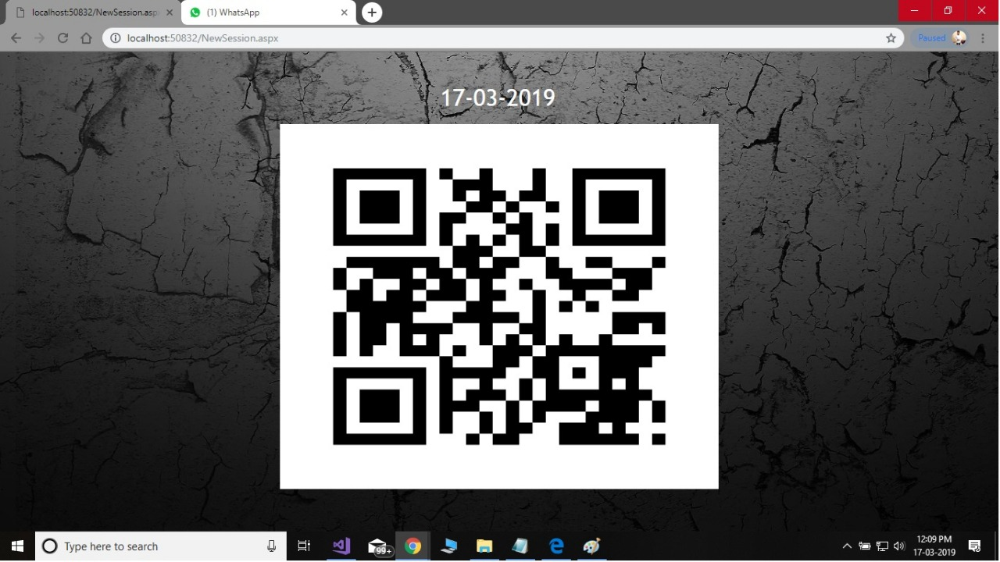
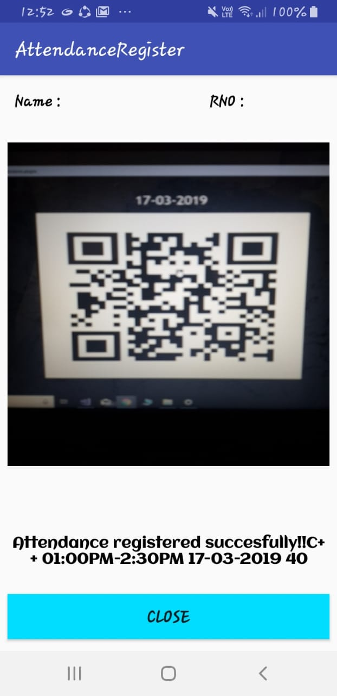

# QR-Attendance
Attendance system using QR Code.

The current system requires to manually take roll calls and feed it into the system which is extremely time consuming and tedious process for the faculty.
Our system:
A portal will be built where the faculty needs to login and select time and subject. The QR Code will be generated and displayed on the projector. The students will scan the QR codes using the android app hereby marking their attendance.

**Admin Module**
Lets you:
<ul>
  <li>Add/update/Delete Course</li>
  <li>Add/update/Delete Subject for semester</li>
  <li>Add/update/Delete Faculty</li>
  </ul>

*Screenshots* 

**Faculty Module**
 
The faculty will select the subject.
Accoring to the systems current time the slot for the lecture will be selected automatically.
The generate button will generate a new QR Code which will than be refreshed in every 5 seconds.
The student will have to scan the QR Code using the android application to mark his/her attendance.

 
<i>Screenshots</i>

**Android App**
 
The student will scan the QR Code displayed by the faculty and automatically his.her attendance will be marked for the lecture.
 
<i>Screenshots</i>

